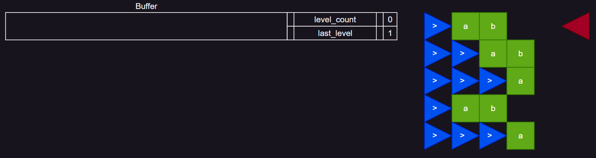
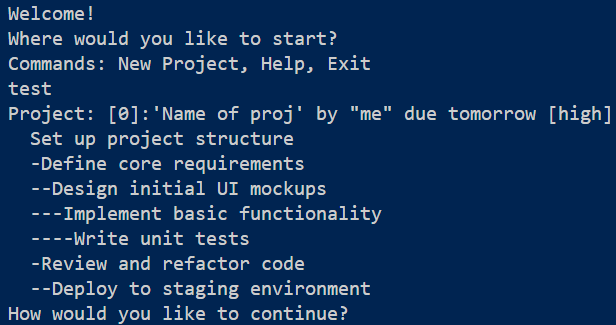

# Todo App

## CLI Implementation

> **Note** *The ">" operator locks stdout meaning only dbg prints will appear in the terminal*
>
> `cargo r test exit > output.txt`

### The scheduler

#### [See char parsing](src/char%20parsing.md)

| | |
|-|-|
|||
